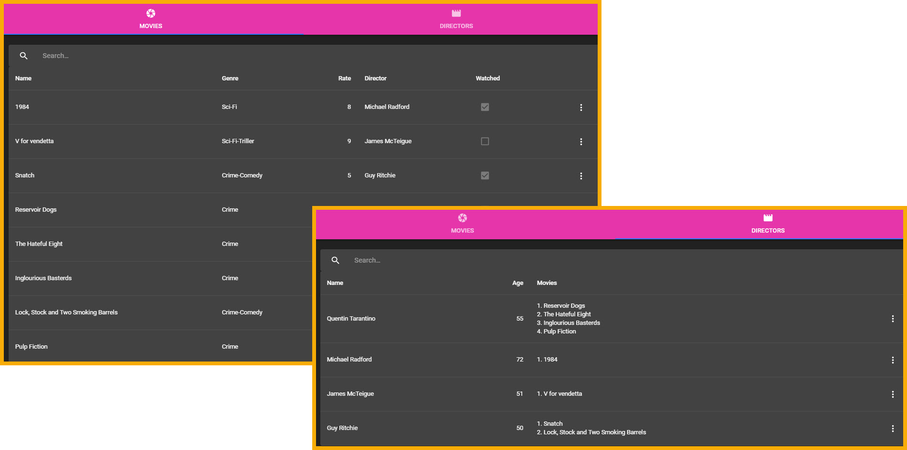

# MongoDB-GrapghQL-React-Apollo-Node.JS

#### Приложение, в котором на основе GraphQL-запросов реализованы CRUD-операции при работе MongoDB-коллекциями фильмов и режисcеров



### Использованные ресурсы и инструменты

- [GraphQL](https://graphql.org/) - язык запросов для работы с NoSQL базой данных
- [VSCode](https://code.visualstudio.com/) - редактор кода
- [MongoDB](https://www.mongodb.com/) - NoSQL база данных
- [Mongoose](https://mongoosejs.com/) - инструмент для работы с базой данных
- [Express ](https://expressjs.com/ru/) - фреймворк для создания сервера на Node.js
- [express-graphql](https://www.npmjs.com/package/express-graphql) - GraphQL HTTP сервер, устанавливаемы в Express как middleware
- [Create React App](https://www.npmjs.com/package/create-react-app) -
  рабочее окружение на основе React
- [Material-UI](https://material-ui.com/ru/) - React компоненты для UI
- [Apollo Client](https://www.apollographql.com/docs/tutorial/client/) - Apollo

### Установка зависимостей:

- Для сервера: npm i express nodemon graphql express-graphql mongoose cors --save
- Для приложения (UI): npm i apollo-boost react-apollo graphql @material-ui/core @material-ui/icons react-swipeable-views recompose

### Запуск сервера и приложения одной коммандой

После копирования приложения на свой компьютер, нужно установить зависимости из package.json и
application/package.json и в консоли выполнить команду:

```js
npm run start
```

### Как создавалось приложение

[Заметки об основных этапах работы над приложением](./comments.md)
